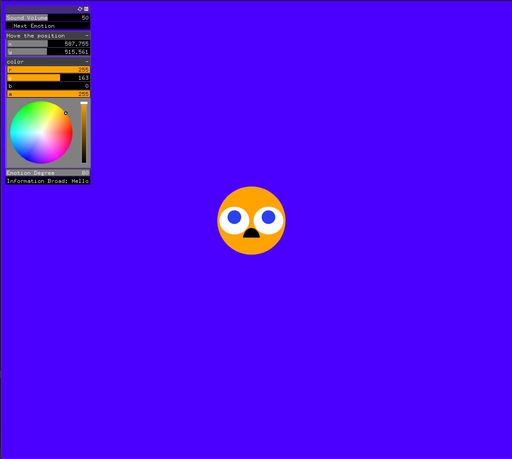
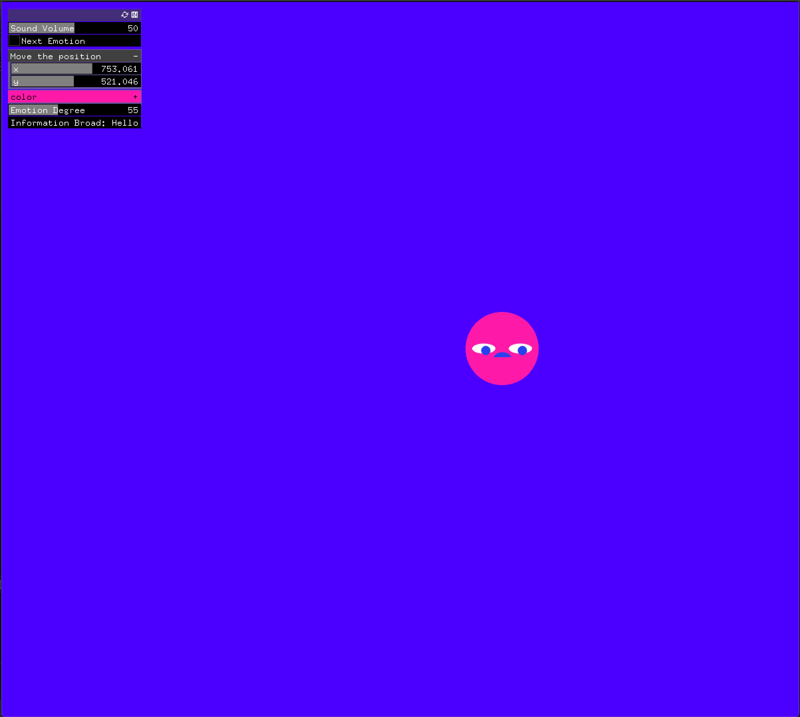
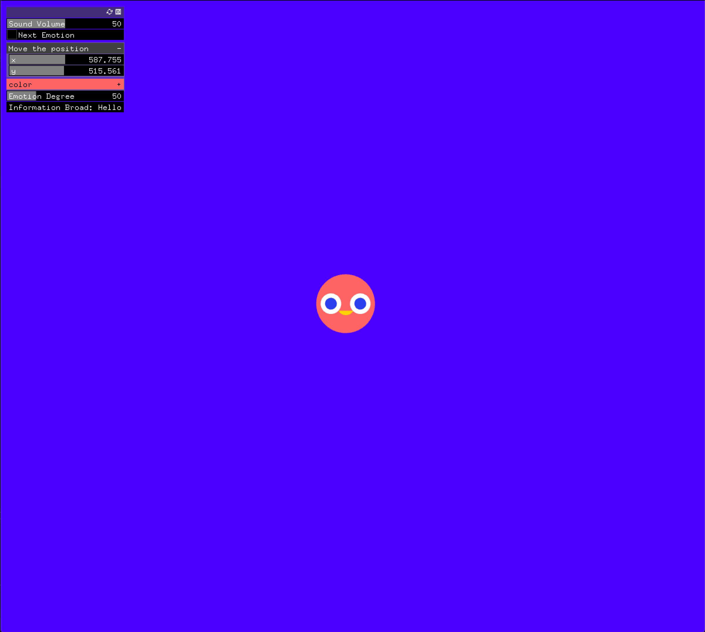
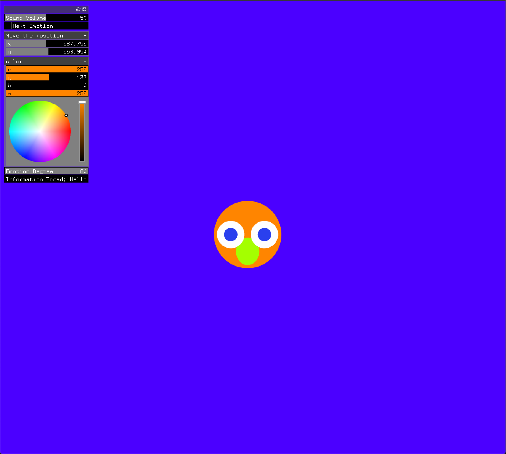

# Project 7

Create a new project using the code from the last emotion assignment.

Remove all timer related changes and movement.

Create a UI with the following:

An ofxFloatSlider to control the sound volume
An ofxButton to rotate between which emotion is being displayed
An ofxVec2Slider to change the x,y of all shapes being drawn
An ofxColorSlider to select the color of one shape in the drawing
An ofxIntSlider shape movement (degree of emotion)
Appropriate labels
Use translation, scaling, and rotation to add at least 3 new features to the existing emotions.
___________
### Screenshot

__________
### Youtube Link:

