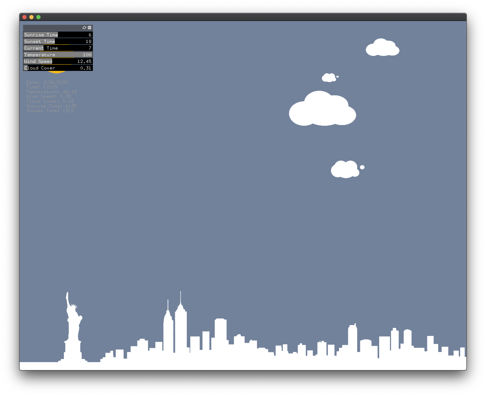
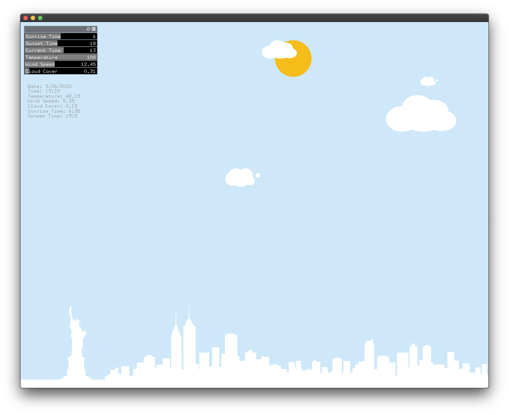
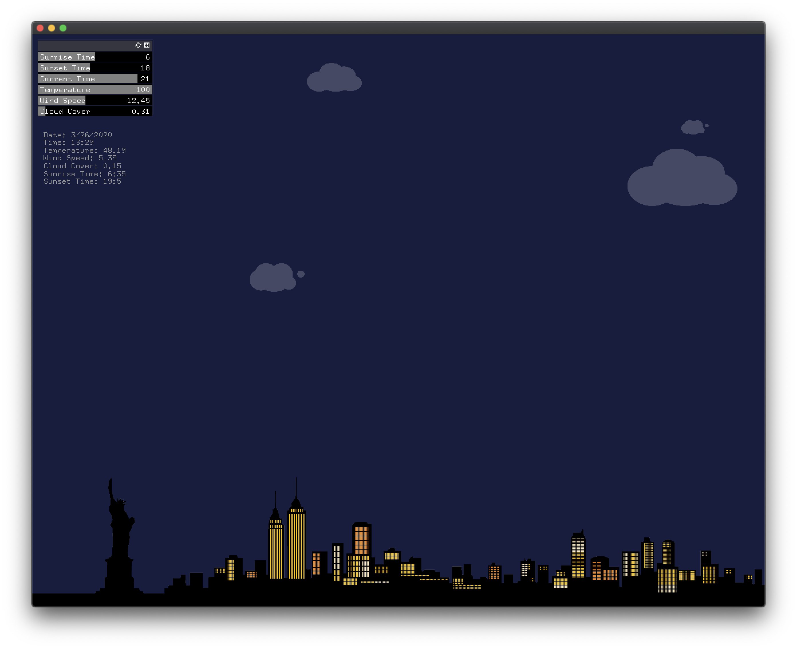

# Project 8

## Requirement
Clone the ofxJSON Addon and put it in the "addons" directory.

Get an API key on darksky.

Create a new project using ofxJSON.

Get latitude and longitude for any city on the planet.

Craft a "Forecast Request" URL for your city.

NYC Example: https://api.darksky.net/forecast/YOUR_KEY/42.3601,-71.0589

Make the request and print the resulting JSON out via cout.

Within the window print time (in epoch format), sunriseTime, sunsetTime, temperature, and two other values of your choice.

Use integer division to calculate and additionally print the current day of the year, hour, and minute.

Translate 4 values from the above request to a visualization.

Create an appropriate GUI to manually force each value. (show changes in your video)

Example: Use sunrise/sunset/hour to change the background color. Use temperature to change the color of a leaf.

Prepare your first project for next week's crit.
___________
### Screenshot

__________
### Youtube Link:

