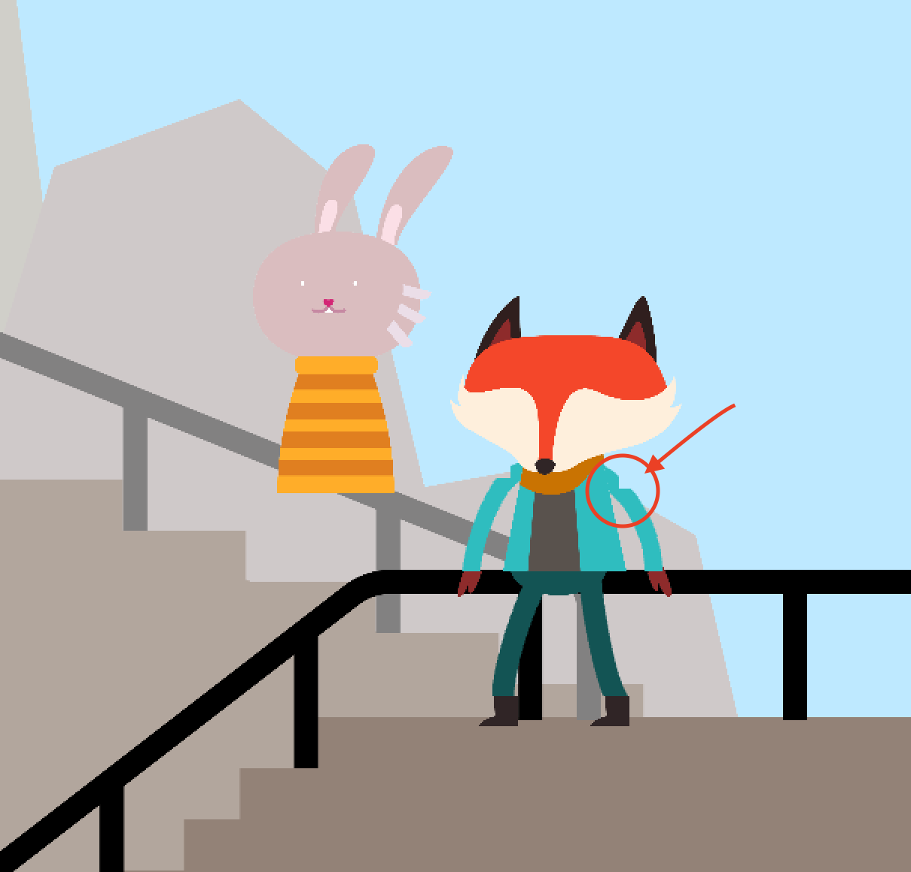

# Final Project 1

## Instruction
I'd like to make an animation based on the song Stop The World from the musical Come From Away.
Users can have some simple interactions with the charater (e.g. moving charatcers, interacting with the scene and other characters, changing the scenes)

Here is the design for the two main characters

___________
## Problems
1. I have a display error when I used the ofDrawBezier function. It seems like there is a notch in the curve.

The code for the arms is in the drawFoxDef() function.

2. If I want to draw a buch of objects(e.g. birds, clouds...) in openFrameworks, what should I do? ( or how can I use array in OF?)

3. If I want to switch between different scenarios (e.g. from scene A to scene B), what should I do?

### Thank you!
