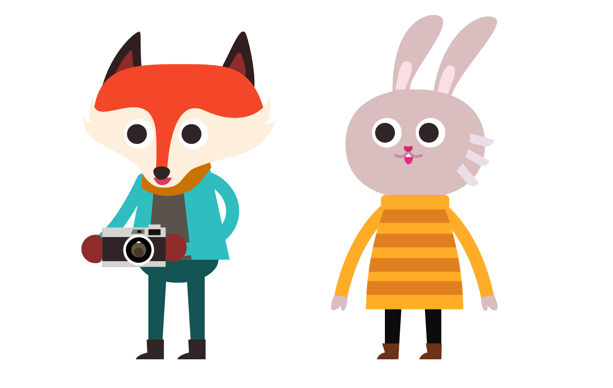
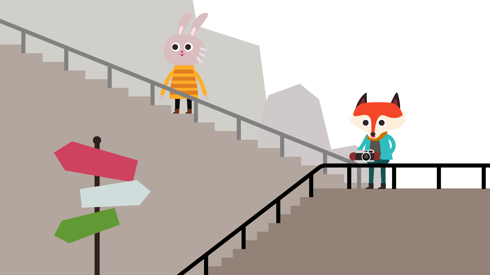
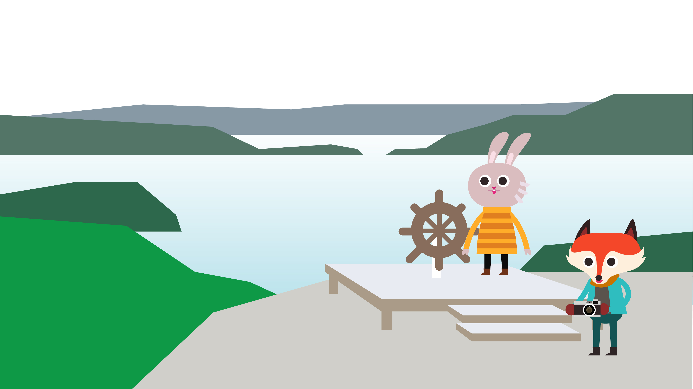
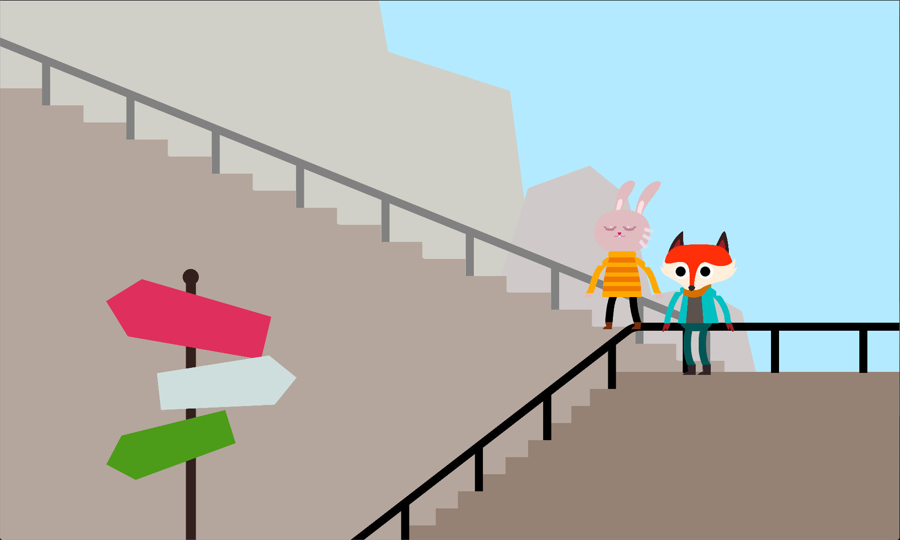
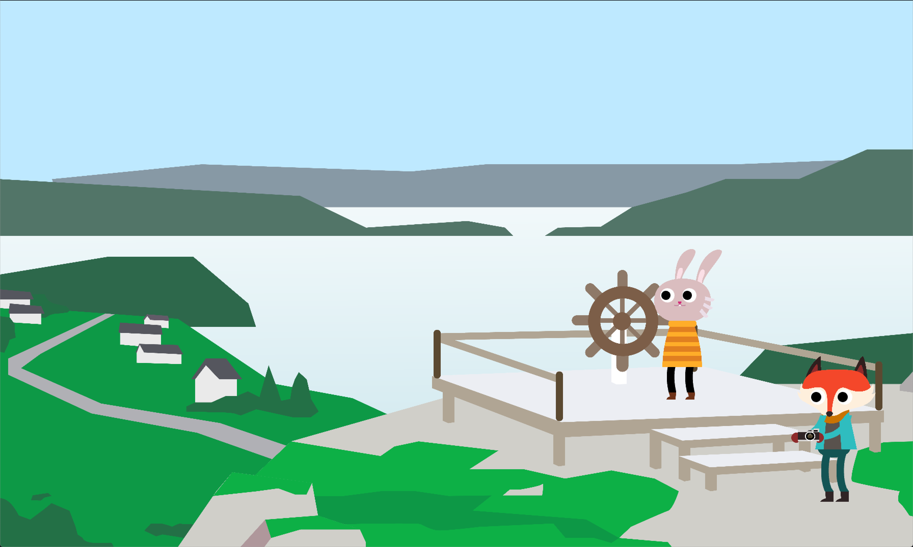
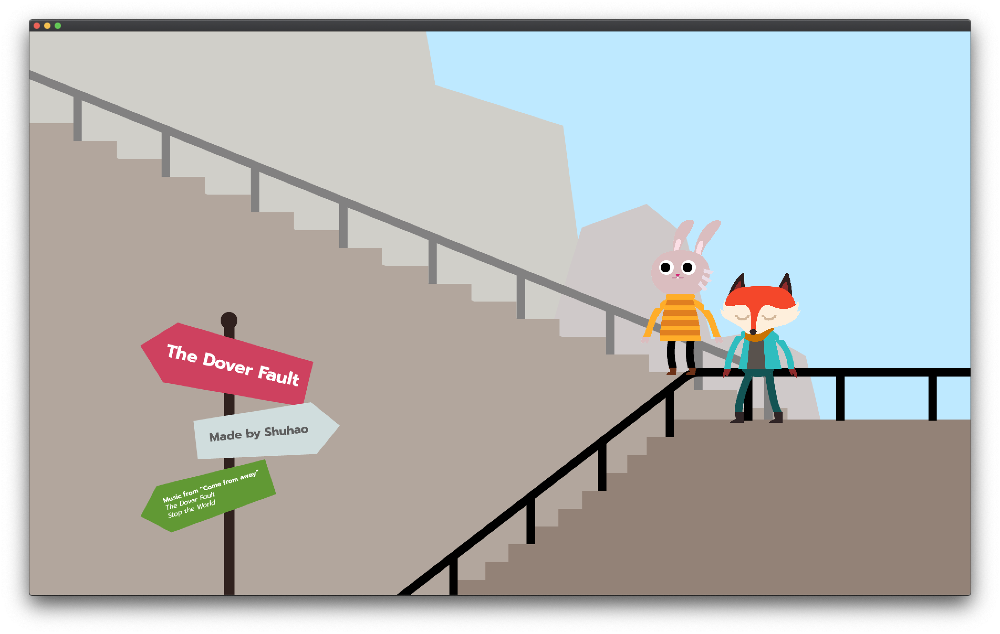
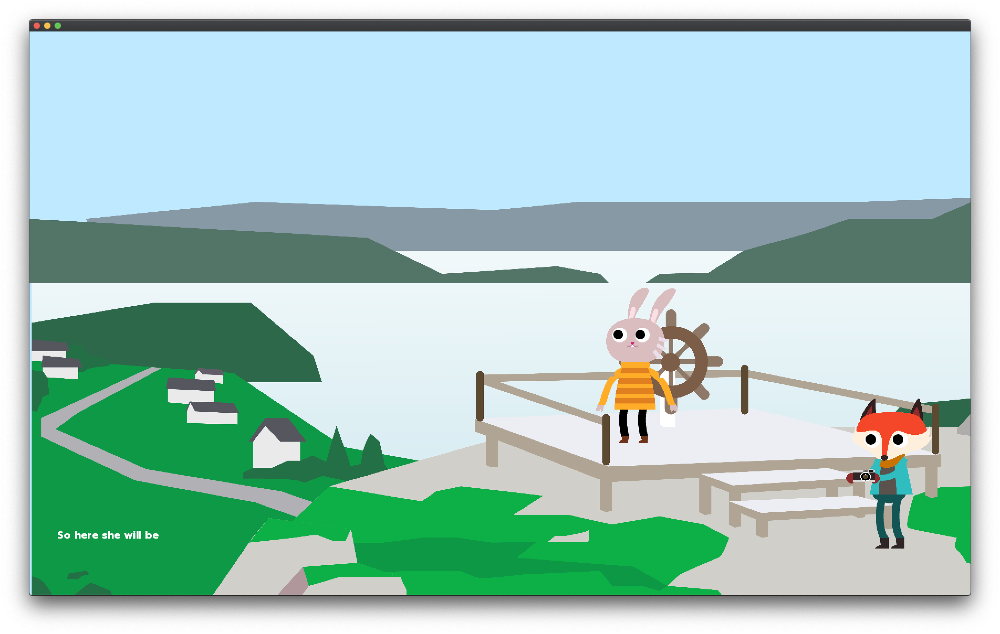
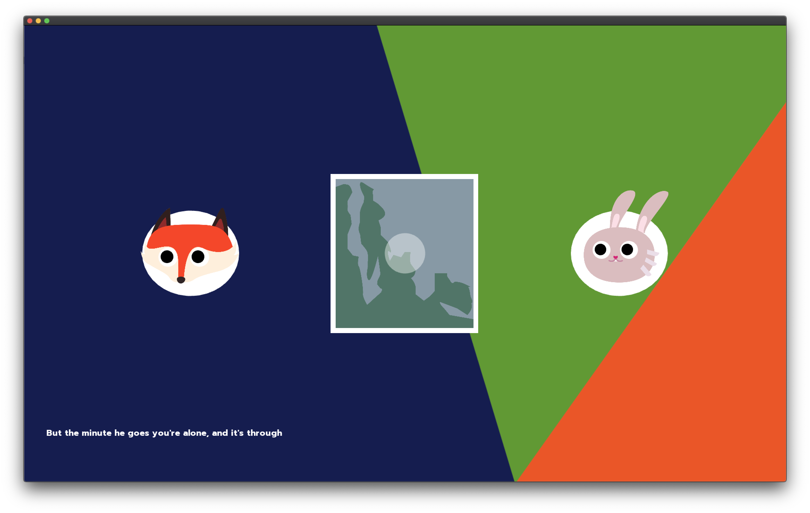
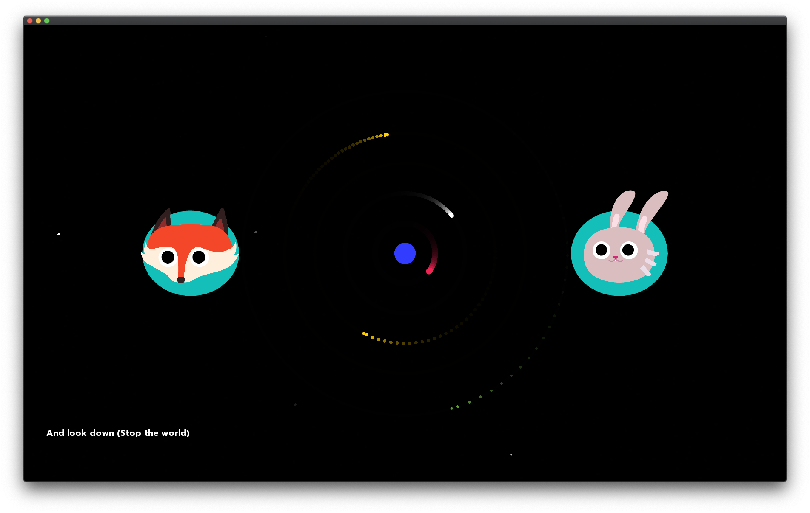

# Project 1 - Stop The World

## Project concept
I'd like to make an animation based on the song **_Stop The World_** from the musical **_Come From Away_**. This song tells the inner dialogue of two people who like each other when they walk to the Dover Fault.

Users can interact with the charater (e.g. moving charatcers, interacting with the scene, shift the scene...)

I designed two main characters according to their personalities -- one is a fox, the other is a rabbit. Users can interact with one of them when their part of music is played.
I also designed the Dover Fault as the main scene of the story.

Here is the design for the two main characters and the main scenes

In this project, I wish audiences can enjoy the love and warmth behind the music through this lovely animation and interactive experience. 

## The ideal user
The ideal user is the people who have seen the musical **_Come From Away_** or anyone who likes musicals.

## Future iterations
- Add more animations and interactions (It is supposed to be a 5 minutes experience)
- Add subtitles (lyrics)
- Perfect the details (e.g. make the animation smoother, draw details for the scene...)

## Process questions
- I still have the display problem when I draw a bezier curve.
- I am also confused about how to make smooth animation (e.g. walking). At present the walking animation of the character is achieved by alternating two static frames.

## Screenshots
### Prototype

### Second iteration

## Youtube Link 
### Second iteration

