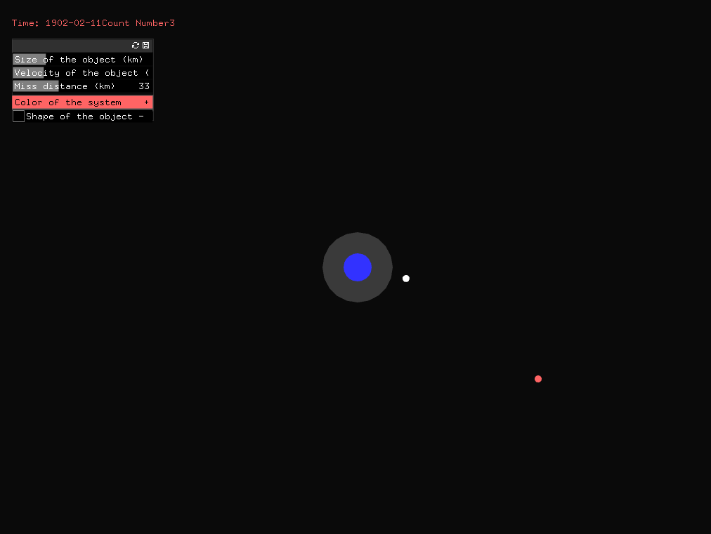
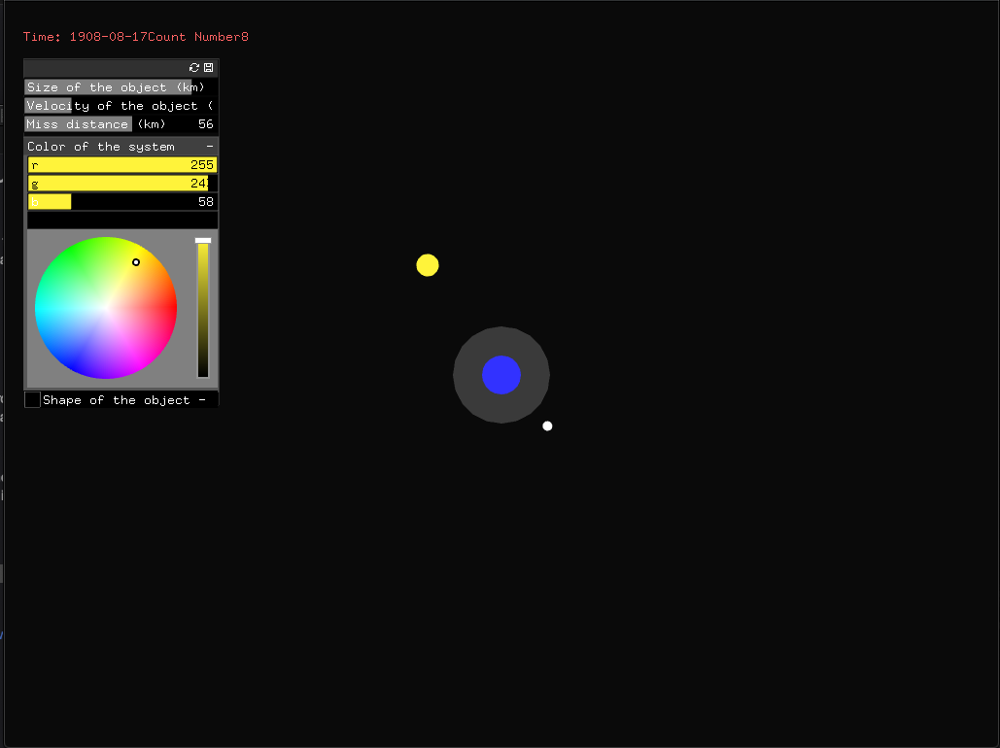

# Project 2 - Data Visualization - NASA NeoWs API

## Project concept
In this project, I used the NASA NeoWs API to simualte how those Near Earth Asteroids are closed to Earth. Users can release an Asteroids by pressing the space bar. At same time, users can adjust sliders to change the orbit, speed and size of the Asteroid.

## The ideal user
For everyone who live on earth

## Future iterations
- Add the detection function: when an Asteroid gets too close to Earth, people will fire a missile to destroy it.
- Add more visual effects (e.g. stars in the background)

## Process questions
- I want to create a series of Asteroids on the screen when user presses the Space bar several times. So I'd like to know how can I create an array of object in Openframeworks

## Screenshots

## Youtube Link 

